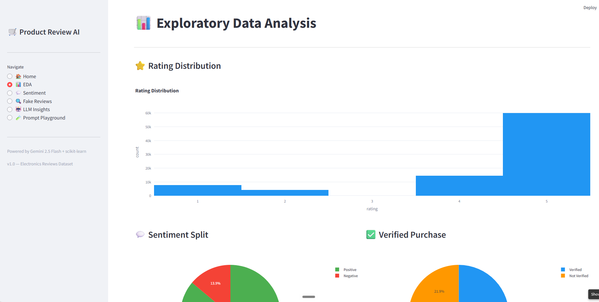
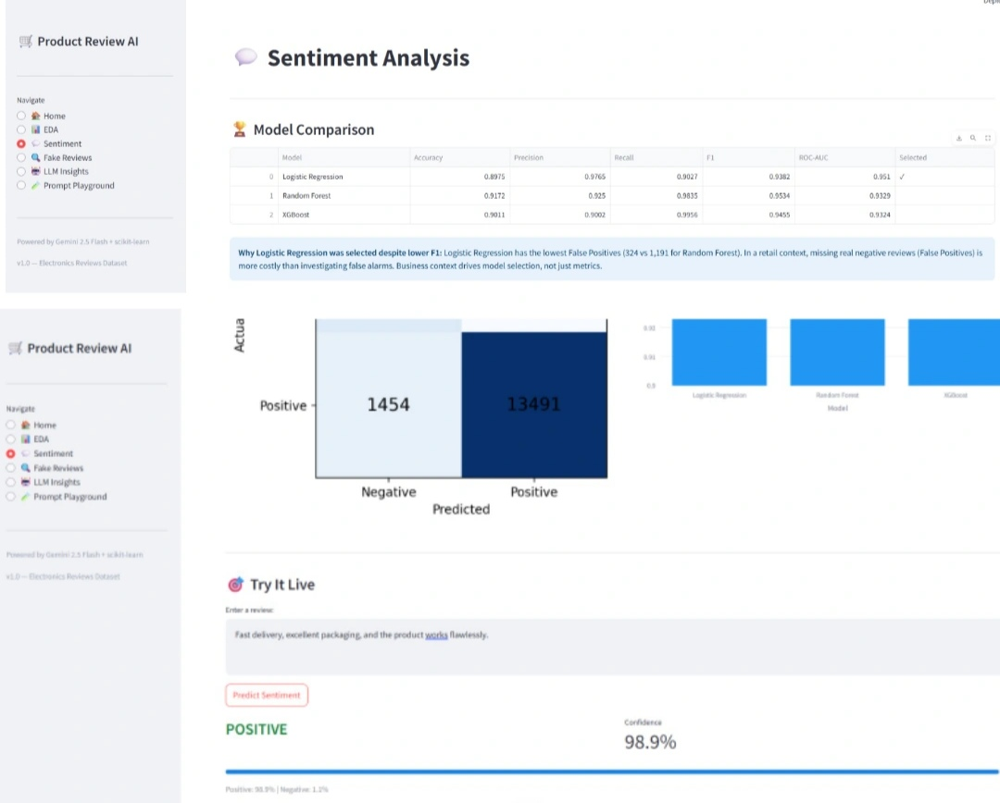
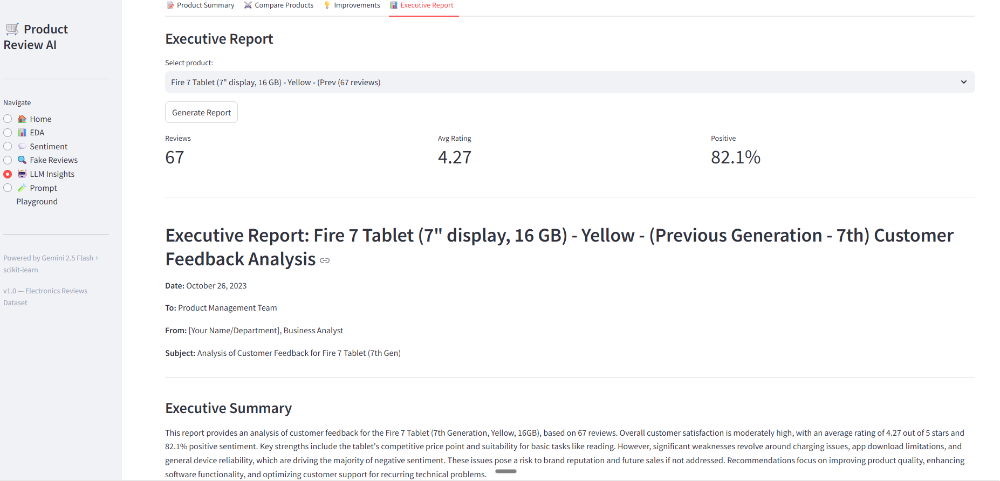

# 🛒 Product Review AI

An end-to-end AI platform that analyzes e-commerce customer reviews 
to surface business intelligence — sentiment trends, fake review detection, 
product insights, and executive reports.

> Turn thousands of customer reviews into actionable decisions.

---

## Features

| Feature | Description |
|---------|-------------|
| 💬 Sentiment Analysis | Classify reviews as positive/negative with confidence scores |
| 🔍 Fake Review Detection | Detect suspicious reviews using behavioral signals + XGBoost |
| 🧩 Aspect Extraction | Find what customers say about battery, camera, price, screen... |
| 📝 Product Summary | LLM-generated summaries from real customer reviews |
| ⚔️ Product Comparison | Side-by-side AI comparison of two products |
| 💡 Improvement Recommendations | Top 5 product fixes ranked by customer impact |
| 📊 Executive Report | Full business report with PDF download |
| 🧪 Prompt Playground | Compare zero-shot vs few-shot vs chain-of-thought prompting |

---

## Screenshots

### Home Dashboard


### EDA Analysis


### Sentiment Analysis


### LLM Executive Report

---

## Tech Stack

| Layer | Technology |
|-------|------------|
| ML Models | Logistic Regression, Random Forest, XGBoost |
| LLM | Google Gemini 2.5 Flash (REST API) |
| Prompt Engineering | Zero-shot, Few-shot, Chain-of-Thought |
| NLP | spaCy, TF-IDF (ngram 1-2) |
| Explainability | SHAP |
| Experiment Tracking | MLflow |
| Backend API | FastAPI + Uvicorn |
| Dashboard | Streamlit + Plotly |
| Database | SQLite |
| Containerization | Docker |

---

## ML vs LLM Design Decisions

| Task | Approach | Reason |
|------|----------|--------|
| Sentiment classification | ML — Logistic Regression | Fast, cheap, SHAP-explainable |
| Fake review detection | ML — XGBoost | Tabular features, no generation needed |
| Product summary | LLM — few-shot | Requires synthesis of multiple reviews |
| Product comparison | LLM — few-shot | Reasoning across two input sets |
| Improvement recommendations | LLM — chain-of-thought | Prioritization + business reasoning |
| Executive report | LLM — instruction-based | Structured long-form generation |

---

## Dataset

Amazon Electronics Reviews (Kaggle)
- 100,000 reviews loaded
- 86,738 after cleaning (removed duplicates, neutral ratings, very short reviews)
- 86% positive, 14% negative (handled with class_weight='balanced')

---

## Setup

```bash
# 1. create environment
conda create -n product_review_ai python=3.10 -y
conda activate product_review_ai

# 2. install dependencies
pip install -r requirements.txt
python -m spacy download en_core_web_sm

# 3. configure environment
cp .env.example .env
# edit .env and add your GEMINI_API_KEY

# 4. run data pipeline
python -m src.ingestion.pipeline

# 5. train models (run notebooks in order)
# notebooks/01_EDA.ipynb
# notebooks/02_Sentiment.ipynb
# notebooks/03_Fake_Review.ipynb
```

---

## Run

```bash
# terminal 1 — start API
uvicorn src.api.main:app --port 8000 --reload

# terminal 2 — start dashboard
streamlit run src/dashboard/app.py
```

- Dashboard: http://localhost:8501
- API docs: http://localhost:8000/docs
- MLflow UI: run `mlflow ui` → http://localhost:5000

---

## Key Technical Decisions

**Model selection:** Logistic Regression chosen over Random Forest (higher F1=0.953)
because it produces 3x fewer False Positives (324 vs 1,191). In retail,
missing a real negative review is more costly than investigating a false alarm.

**Fake review labels:** No ground-truth labels existed. Used weak supervision —
combining duplicate text detection and unverified + short review signals.
Diagnosed and fixed data leakage across 3 iterations before arriving at
honest ROC-AUC of 0.939.

**Prompt strategy:** Few-shot for summaries/comparisons (format consistency),
chain-of-thought for recommendations/reports (analytical depth).

---

## Key EDA Findings

- `review_length ↔ verified_purchase = -0.33` — unverified reviewers write
  longer reviews, likely attempting to appear legitimate (used as fake review feature)
- December 2022 review spike — holiday season effect
- HTML artifacts (`<br>`) found and cleaned from scraped review text
- 2,178 bot accounts removed — same user posting identical text across multiple products

---

## Experiment Tracking

Every model training run is tracked in MLflow with parameters, metrics, and artifacts.

```bash
mlflow ui
# open http://localhost:5000
```

---

## Project Structure

```
ProductReviewAI/
├── data/             # raw and cleaned datasets
├── docs/             # data dictionary, design decisions
├── models/           # trained model files (.pkl)
├── notebooks/        # EDA, sentiment, fake review, LLM 
├── reports/          # generated PDF reports
├── sr
│   ├── ingestion/    # data pipeline (JSONL → SQLite)
│   ├── features/     # TF-IDF + tabular feature 
│   ├── aspect/       # spaCy aspect extraction
│   ├── llm/          # Gemini client, prompts, LLM modules
│   ├── api/          # FastAPI backend
│   ├── dashboard/    # Streamlit pages
│   └── utils/        # DB helpers, config, monitoring
├── Dockerfile
├── docker-compose.yml
└── README.md
```